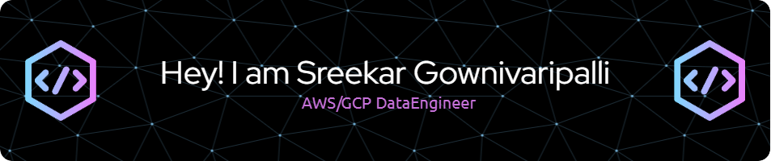

  

## About Me

I'm an experienced **AWS/GCP Data Engineer** with 6 years of expertise architecting and implementing robust data engineering and analytics solutions, primarily in the insurance and healthcare sectors. I specialize in multi-cloud architectures, scalable ETL pipelines, and data warehousing solutions.

   

---

## ⚙️ Skills & Technologies

  
☁️ Cloud Platforms

  

    
    
    
  

  
🔄 Data Engineering & ETL

  

    
    
    
    
  

  
🐍 Programming & Scripting

  

    
    
    
    
    
  

  
🗄️ Databases & Warehousing

  

    
    
    
    
    
    
  

  
📊 BI & Visualization

  

    
    
    
    
  

  
⚙️ DevOps & Containerization

  

    
    
    
    
    
    
  

  
🤖 Machine Learning

  

    
    
    
    
  

## 🚀 Experience

  <!-- Tile 1: CareSourse -->
  

    <h3 style="color: #333;">CareSourse</h3>
    
AWS/GCP Data Engineer

    
<em>Oct 2023 - Present</em>

    

      
View Details

      <ul>
        <li>Architected multi-cloud solutions for insurance claims processing and reinsurance reporting.</li>
        <li>Developed ETL workflows using AWS Glue, PySpark, and Apache Airflow.</li>
        <li>Built CI/CD pipelines with GitHub, Jenkins, and Docker.</li>
        <li><strong>Technologies:</strong> AWS (EC2, S3, Redshift, Glue, CloudWatch), GCP (BigQuery, Cloud Dataflow), Docker, Kubernetes</li>
      </ul>
    

  

  <!-- Tile 2: Cognizant Technology Solutions -->
  

    <h3 style="color: #333;">Cognizant Technology Solutions</h3>
    
Programmer Analyst / Data Engineer

    
<em>Feb 2021 - Aug 2023</em>

    

      
View Details

      <ul>
        <li>Migrated on-premises databases to cloud environments.</li>
        <li>Developed real-time data ingestion pipelines with AWS and explored GCP and Azure integrations.</li>
        <li>Automated infrastructure deployment using Terraform and CloudFormation.</li>
        <li><strong>Technologies:</strong> AWS, GCP, Azure, PySpark, Hadoop, Informatica, Jenkins</li>
      </ul>
    

  

  <!-- Tile 3: Optum -->
  

    <h3 style="color: #333;">Optum</h3>
    
ETL & Data Pipeline Engineer

    
<em>May 2019 - Jan 2021</em>

    

      
View Details

      <ul>
        <li>Designed and implemented data warehousing and reporting solutions using Informatica and Snowflake.</li>
        <li>Developed robust ETL workflows for reinsurance reporting.</li>
        <li>Optimized batch processing using Hadoop and SAP BusinessObjects.</li>
        <li><strong>Technologies:</strong> PL/SQL, Informatica, Snowflake, Hadoop, SAP BO, Autosys</li>
      </ul>
    

  

## Education

**Master of Science in Information Technology & Management**  
*Bryan School of Business & Economics, University of North Carolina Greensboro (2023-2024)*  
GPA: 4.0/4.0

---

## Achievements

- **Publication:** *IoT-Based Environment Monitoring System To Protect Heritage Artefacts*  
- **Membership:** BETA GAMMA SIGMA Honor Society  
- **Awards:** Bryan School Award & Faculty Choice Best Graduate Student Award

---

<!---
SreekarGpalli/SreekarGpalli is a ✨ special ✨ repository because its `README.md` (this file) appears on your GitHub profile.
You can click the Preview link to take a look at your changes.
--->
